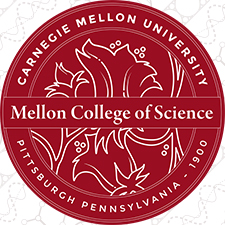
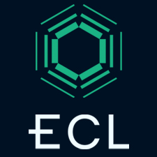

  
  <h1 align="center">
  CMU Cloud Lab
    </h1>

  
  
  

<h3 align="center">
  Bring your research to the next level.
</h3>

  Based on a concept pioneered by two CMU alumni, their company Emerald Cloud Lab (ECL) is the world’s first Academic Cloud Lab that allows you to remotely control a complete life sciences laboratory from your computer.
  

<a href="https://youtu.be/uJIiOc2-iiw" target="_blank">Video: Automated Science using the CMU Cloud Lab</a>
  

    

## 🏛 Training

While anyone is freely available to participate in our [Discussions](https://github.com/orgs/cloudlab-cmu/discussions), training is necessary in order to gain access to the CMU Cloud lab. You can review and select the training that best fits your needs here: <a href="https://cloudlab.cmu.edu/training/" target="_blank">Cloud Lab Training</a>

 

## 💬 Community

If you have a question or would like to talk with other CMU Cloud lab users and join our community, please hop over to [Github discussions](https://github.com/orgs/cloudlab-cmu/discussions)

You can also review, use and improve our [Public Protocols](https://github.com/cloudlab-cmu/Public-Protocols) for your own research projects, [Make a Feature Request](https://github.com/orgs/cloudlab-cmu/discussions/categories/feature-requests), or [Report a Bug](https://github.com/cloudlab-cmu/Public-Protocols/issues)

 

## ❗ Code of conduct

Budibase is dedicated to providing a welcoming, diverse, and harrassment-free experience for everyone. We expect everyone in the Budibase community to abide by our [**Code of Conduct**](docs/CODE_OF_CONDUCT.md). Please read it.

 

## 🙌 Contributing to the CMU Cloud Lab

From opening a bug report to creating a pull request: every contribution is appreciated and welcomed. If you're planning to implement a new feature or change the API please create an issue first. This way we can ensure your work is not in vain.

<!-- markdownlint-restore -->
<!-- prettier-ignore-end -->

<!-- ALL-CONTRIBUTORS-LIST:END -->

This project follows the [all-contributors](https://github.com/all-contributors/all-contributors) specification. Contributions of any kind welcome!
